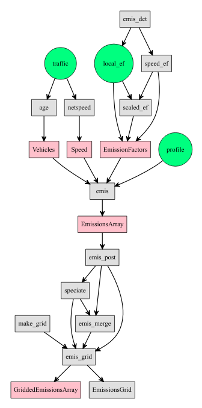

# Structuring an Emissions Inventory {#st}

The elaboration of vehicular emissions inventories in vein, consists of four stages:

1. pre-processing activity data,
2. preparing emissions factors,
3. estimating the emissions and
4. post-processing of emissions in maps and databases.

This means that vein provides functions to be used in each of the stages. However,
in order to follow these stages, a structure of directories with scripts including
vein functions is necessary. Therefore, the vein function `inventory` was created
to create this structure of directories.

## Overview of emissions inventorying using VEIN {#veinstructure}

```{r , eval = FALSE, include=FALSE, fig.cap='Structuring an emissions inventories with VEIN', out.width='100%', fig.asp=.75, fig.align='center'}
library(DiagrammeR)

p1 <- grViz("digraph boxes_and_circles {
      graph [overlap = false,
            fontsize = 10,
            rankdir = TB,
            fontname = Helvetica]


      node [shape = box,
            style = filled,
            fillcolor = pink,
            fixedsize = false,
            color = black,
            fontcolor = black,
            fontize = 12]

      Vehicles;
      Speed;
      EmissionFactors;
      EmissionsArray;
      GriddedEmissionsArray;


      node [shape = circle,
            style = filled,
            fillcolor = SpringGreen,
            fixedsize = false,
            color = black,
            fontcolor = black,
            fontize = 12]

      traffic;
      profile;
      local_ef;

      node [shape = box,
            style = filled,
            fixedsize = false,
            fillcolor = grey88,
            color = black,
            fontcolor = black,
            fontize = 12]

      age;
      speed_ef;
      scaled_ef;
      emis;
      emis_det;
      emis_post;
      speciate;
      make_grid;
      emis_grid;
      emis_merge;

      edge [color = black,
            arrowhead = vee,
            penwidth = 1.5]

      emis_det->{local_ef speed_ef}
      traffic->netspeed
      traffic->age
      age->Vehicles
      netspeed -> Speed
      {Vehicles Speed profile}->emis
      local_ef->{scaled_ef EmissionFactors}
      speed_ef-> {scaled_ef  EmissionFactors}
      scaled_ef -> EmissionFactors
      EmissionFactors -> emis
      emis -> EmissionsArray
      EmissionsArray -> emis_post
      emis_post->{speciate emis_merge emis_grid}
      speciate -> emis_merge
      {make_grid speciate emis_merge}->emis_grid
      emis_grid -> {EmissionsGrid GriddedEmissionsArray}
      }
      ")
p1
```


```{r diavein, echo = FALSE, fig.cap='Structuring an emissions inventories with VEIN', out.width='100%', fig.asp=.75, fig.align='center'}

```


## The `inventory` function

The inventory function creates creates a structure of directories and scripts
to run vein. This structure is a suggestion and the user can use any other.
The following code shows the arguments of the function. This is done using
the base function `args` with `inventory`.

```{r, message=FALSE, echo=FALSE}
library(vein)
```

```{r}
args(inventory)
```

The arguments are `name`, `vehcomp`, `scripts`, `show.dir`, `show.scripts` and
`clear`.

- The argument `name`

The argument name is a word to be used as main directory where directories and scripts are
stored in. It consists in *one* word with ascii characters. It is also
recommended to be used without any special character or accents, for instance:

```{r, eval = FALSE}
name = file.path(tempdir(), "YourCity")
inventory(name = name, show.dir = TRUE, show.scripts = TRUE)
```


- The argument `vehcomp`
This argument is very important and comes from _Vehicular Composition_, which is
the classification of the fleet by type of use, type of fuel, size of engine and
gross weight, based on definitions of @Corvalanetal2002. There is also the
_technological composition_ of the fleet which relates the technological
modifications of the car in order to accomplish the emissions standards. However,
vein uses a distribution by age of use as \@ref(traffic) shows.

The vehicular composition `vehcomp` has 5 types of vehicles:

1. Passenger Carss (PC).
1. Light Commercial Vehicles (LCV). 
1. Heavy Good Vehicles or trucks (HGV).
1. Buses (BUS).
1. Motorcycles (MC).

The default value of this argument is: `c(PC = 1, LCV = 1, HGV = 1, BUS = 1, MC = 1)`, 
which means that there are 1 types of PC, 1 of LCV, 1 of trucks, 1 of buses and
1 types of motorcycles. This vehicular composition is only for ilutrasting that
the user can change these values according to its own data. Appendix B
shows the vehicular composition from the vehicular emissions inventory of the 
Environmental Agency of São Paulo, Brazil [@CETESB2015]. In Brazil, the fuel used 
in vehicles is blended with ethanol with and biodiesel. The user can use **any** 
vehicular composition that representes its fleet with up-to 99 types of vehicles per
category. For instance, if there are 4 types of PC in a fleet, `PC = 4`, and
each one has aa age of use distribution.


- The argument `show.dir`

This is a logical argument to decide if the output of the function will return
print the new directories or not. The use is:

```{r}
name = file.path(tempdir(), "YourCity")
inventory(name = name, show.dir = TRUE, show.scripts = FALSE)
```

`inventory` creates the direcrory "YourCity" and the sub directories: daily,
ef, emi, est, images, network and veh.

- **daily**: Directory for storing the profiles saved as .csv files. For instance,
`data(pc_profile)` is a matrix that could be saved as .csv.
- **ef**: Directory for storing the emission factors data-frame, similar to
`data(fe2015)` but including one column for each of the categories of the
vehicular composition. For instance, if PC = 5, there should be 5 columns with
emission factors in this file. If LCV = 5, another 5 columns should be present,
and so on.
- **emi**: Directory with subdirectories matching the vehicular composition for
saving the estimates. It is suggested to use .rds extension instead of .rda.
- **est**: Directory with subdirectories matching the vehicular composition for
storing the scripts named `input.R`. 
- **images**: Directory for saving images.
- **network**: Directory for saving the road network with the required
attributes. This file will include the vehicular flow per street to be used 
by functions `age_ldv`,  `age_hdv`,  `age_moto` or `my_ldv`.
- **post**: Directory for storing the processed emissions. It includes the
directories **df** for emissions by age of use, hour and other parameters,
**streets** for storing the total emissions by streets and **grids** for storing
total gridded emissions by pollutant.
- **veh**: Directory for storing the distribution by age of use of each category
of the vehicular composition. Those are data-frames with number of columns with
the age distribution and the number of rows as the number of streets. The class
of these objects is "Vehicles".


- The argument `scripts`

This argument adds scripts into the directories. The default is TRUE. The type
of scrits create are:

- main.R: Adds the `setwd("YourCity")`, `library(vein)`, `source(traffic.R)`,
some comments and a loop to source all inputs. It is recommended not using
the loop till it is certain that all scripts are correct.
- traffic.R: Includes two lines with exampmles of how to use the `age_ldv`
function and saving the output in the directory veh.
- input.R: Each file has the scripts for reading the network, vehicles, emission
factors and estimating emissions.


- The argument `show.scripts`

This argument prints the scripts created:

```{r}
name = file.path(tempdir(), "YourCity")
inventory(name = name, show.dir = FALSE, show.scripts = TRUE)
```


- The argument `clear`

This is a logical argument that deletes recursively when TRUE, or not when FALSE,
the directory and creates another one. Default is TRUE.

The following chapters show the use of other vein functions inside an structure
of directories and scripts with the name `inventory("YourCity")`.
