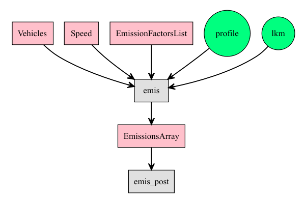

# Estimation of emissions {#est}

The emissions estimation process was shown on Eq. \@ref(eq:emi) on chapter \@ref(ef). In this equation, it was shown that how the emissions are obtained by multiplying the traffic flow with the distance that each car travels (length of the road if it is a road network), and emissions and deterioration factors.

In this chapter, I will show how VEIN interprets this and other emission equations to estimate emissions. At the end of each section, The Fig. \@ref(fig:diaemis) shows a diagram with the estimation process. The pink boxes hows VEIN classes, the circle data, and the grey boxes functions. The object `Vehicles` is a class consisting of a matrix of vehicles with units $1 \cdot h^{-1}$, as shown in chapter \@ref(traffic). However, _the units in `Vehicles` is not a requirement for estimating emissions_. The object of class `Speed` is a  matrix of speeds with the number of columns as the calculated speeds at different hours at each row. This object can be present or not, depending on the type of emission factor considered, for an instant, emission factors not depending on speed. The object class of `EmissionFactorsList` are a list of functions depending on speed as $f(V)$. Each function can depend on speed or not as shown in chapter \@ref(ef), section \@ref(localef).  Lastly, the object lkm is the length of the road expressed in $lkm$.

The function `emis` reads the inputs and estimates the emissions producing an object with class `EmissionsArray` which has 4 dimensions, number of streets, ages of use of a vehicle, number of hours and number of days.

```{r , include = FALSE, eval = FALSE, fig.cap='Emissions estimation process with VEIN', out.width='80%', fig.asp=.75, fig.align='center'}
library(DiagrammeR)
p1 <-grViz("digraph boxes_and_circles {
      graph [overlap = false,
            fontsize = 10,
            rankdir = TB,
            fontname = Helvetica]

      node [shape = box,
            style = filled,
            fillcolor = pink,
            fixedsize = false,
            color = black,
            fontcolor = black,
            fontize = 12]

      Vehicles;
      Speed;
      EmissionFactorsList;
      EmissionsArray;

      node [shape = circle,
            style = filled,
            fillcolor = SpringGreen,
            fixedsize = false,
            color = black,
            fontcolor = black,
            fontize = 12]

      profile; 
      lkm;

      node [shape = box,
            style = filled,
            fixedsize = false,
            fillcolor = grey88,
            color = black,
            fontcolor = black,
            fontize = 12]

      emis;
      emis_post;

      edge [color = black,
            arrowhead = vee,
            penwidth = 1.5]

      {Vehicles Speed profile lkm EmissionFactorsList}->emis
      emis -> EmissionsArray
      EmissionsArray -> emis_post
      }
      ")
```

```{r diaemis, echo = FALSE, fig.cap='Emissions estimation process with VEIN', out.width='80%', fig.asp=.75, fig.align='center'}

```

The estimation process is done with the emissions functions. The emissions estimations functions are:

- `emis` for hot emissions,
- `emis_cold` for cold start emissions,
- `emis_evap` for evaporative emissions,
- `emis_paved` for resuspension emissions on paved roads, and
- `emis_wear` for wear of brakes, tires, and roads.

These functions perform internal checks for ensuring that the length lkm has the unit of $km$. This means that, if `lkm` has units different than $km$, the function will not run. These function runs internally `lapply` which are faster `for` written in C. Despite that these functions are fast, i will try to make them faster with some RCPP implementation in the future.

## The `emis` function

The arguments of `emis` are:

```{r}
args(vein::emis)
```

- `veh`: "Vehicles" data-frame or list of "Vehicles" data-frame. Each data-frame has some columns matching the age distribution of that type of vehicle. The number of rows is equal to the number of streets link.
- `lkm`: Length of each link that must in $km$. As consequence, emission 
factors must be in $g \cdot km^{-1}$. 
- `ef`: "EmissionFactorsList". A list of emission factors as speed functions. Each element has the form $f(V)$. The implicit unit is
$g \cdot km^{-1}$.
- `speed`: "Speed" object. A Speed data-frame with some columns as
hours. 
- `agemax`: Age of oldest vehicles of the vehicles veh. The information of this argument can be obtained from the `veh` argument. Therefore, this argument will be deprecated.
- `profile`: Numerical or dataframe or matrix with nrows equal to the hours and cols to each day. This is traffic data normalized to the hour of the input traffic data.
- `hour`: Number of considered hours in estimation. As this information
can be derived from the argument `profile`, the default value is the number of rows of the matrix profile.
- `day`: Number of considered days in estimation. As this information
can be derived from the argument `profile`, the default value is the number of columns of the matrix profile.
- `array`: When FALSE produces a dataframe of the estimation. When TRUE 
expects a profile as a dataframe producing an array with dimensions (streets x columns x hours x days)

When the only arguments present in the function are **veh**, **lkm** and **ef** assumes a _top-down_ and shows a message.

## The `emis_cold` function

The arguments of `emis_cold` are:

```{r}
args(vein::emis_cold)
```

The arguments are similar to `emis` with the difference that it is added
two arguments:

- `cold`: List of functions of cold start emission factors of vehicular categories. Technically, each function is also of the form $f(V)$.
- `beta`: Datraframe with the hourly cold-start distribution to each day of the period. Some rows are hours and columns are days. It represents the fraction of mileage driven under cold-start conditions.

The equation for estimating cold-start emissions is on Eq. \@ref(eq:cold).

## The `emis_evap` function

The estimation of evaporative emissions applies Tier 2 from 
-@MelliosNtziachristos2016. The approach followed in VEIN was very merely, consisting in only adding elements of a data-frame.


```{r}
args(vein::emis_evap)
```

- `veh`: this is the number of vehicles at each age of use and for each street.
It is a `Vehicles` object.
- `name`: Character indicating the name of the vehicle.
- `size`: Character indicating the size of the vehicle.
- `fuel`: Character indicating the fuel of the vehicle.
- `age`: Numeric vector with the age distribution, for instance, 1:40 for vehicles between 1 and 40 years of use.
- `nd4`: Number of days of your period of study with monthly average Temperature between 20 and 35 Celsius degrees. If the period is a year,
it is the annual number of days under that condition.
- `nd3`: Number of days of your period of study with a monthly average 
temperature between 10 and 25 Celsius degrees.
- `nd2`: Number of days of your period of study with a monthly average 
temperature between 0 and 15 Celcius degrees.
- `nd1`: Number of days of your period of study with a monthly average 
temperature between -5 and 10 Celsius degrees.
- `hs_nd4`: Number of average daily hot-soak evaporative emissions for days with the temperature between 20 and 35 Celcius degrees
- `hs_nd3`: Number of average daily hot-soak evaporative emissions for days with the temperature between 10 and 25 Celcius degrees
- `hs_nd2`: Number of average daily hot-soak evaporative emissions for days with the temperature between 0 and 15 Celcius degrees
- `hs_nd1`: Number of average daily hot-soak evaporative emissions for days with the temperature between -5 and 10 Celcius degrees
- `rl_nd4`: Number of average daily running losses evaporative emissions for days with a temperature between 20 and 35 Celcius degrees
- `rl_nd3`: Number of average daily running losses evaporative emissions for days with a temperature between 10 and 25 Celcius degrees
- `rl_nd2`: Number of average daily running losses evaporative emissions for days with a temperature between 0 and 15 Celcius degrees
- `rl_nd1`: Number of average daily running losses evaporative emissions for days with a temperature between -5 and 10 Celcius degrees
- `d_nd4`: Number of average daily diurnal evaporative emissions for days with the temperature between 20 and 35 Celcius degrees
- `d_nd3`: Number of average daily diurnal evaporative emissions for days with the temperature between 10 and 25 Celcius degrees
- `d_nd2`: Number of average daily diurnal evaporative emissions for days with the temperature between 0 and 15 Celcius degrees
- `d_nd1`: Number of average daily diurnal evaporative emissions for days with the temperature between -5 and 10 Celcius degrees


## The `emis_paved` function

Evaporative emissions are emissions of resuspended dust due to traffic circulating over paved or non-paved roads. These emissions can be a vital source of mass particulate matter and several cities programs that aim to improve air quality by diminishing these emissions [@AMATO20103070]. However, these emissions are not considered by in the European emissions guidelines, where their focus is on primary particles and not those resulting from the resuspension of previously deposited material [@NtziachristosBoulter2009].

The method adopted in VEIN comes from the USEPA [@paved] which presents equations for annual, daily and hourly estimations:

\begin{equation}
EF_{paved}=k \cdot sL^{0.91} \cdot W^{1.02}
(\#eq:res1)
\end{equation}

Where

- $EF_{paved}$ is the emission factor of particulate matter.
- $k$ particle size splitter.
- $sL$ road surface silt loading $g \cdot m^{-2}$.
- $W$ average weight.

Equation \@ref(eq:res1) can be extrapolated to consider natural mitigation of  rainy periods of time with daily basis:

\begin{equation}
EF_{anual} = EF_{paved} \cdot (1 - \frac{P}{4 \cdot N})
(\#eq:res2)
\end{equation}

Where

- $EF_{anual}$ annual or long-term emission factor.
- $P$ number of days with accumulated rain above 0.254 mm.
- $N$ total number of days.

alternatively, hourly

\begin{equation}
EF_{hourly} = EF_{paved} \cdot (1 - \frac{1.2 \cdot P}{N})
(\#eq:res2)
\end{equation}

Where

- $EF_{annual}$ annual or long-term emission factor.
- $P$ number of hours with accumulated rain above 0.254 mm.
- $N$ total number of hours. For instance, 8760 for 1 year.


The function `emis_paved` has the arguments:

```{r}
args(vein::emis_paved)
```

Where,

-`veh`: It is an array with dimenssions number of streets x hours of day x days of week.
- `lkm`: Length of each link.
- `k`: K_PM30 = 3.23, K_PM15 = 0.77, K_PM10 = 0.62 and K_PM2.5 = 0.15.
- `sL1`: Silt loading (g/m2) for roads with ADT <= 500.
- `sL2`: Silt loading (g/m2) for roads with ADT > 500 and <= 5000.
- `sL3`: Silt loading (g/m2) for roads with ADT > 5000 and <= 1000.
- `sL4`: Silt loading (g/m2) for roads with ADT > 10000.
- `W`: array of dimensions of veh. It consists in the hourly averaged weight of traffic fleet in each road.

For instance, Let's create an array of vehicles. The function `adt` calculates
the number of vehicles at all hours. Let's use the `data(net)` assuming no buses. Let's calculate the total traffic for only 24 hours with the same profile. For Simplicity, let's assume that all are  _vehicle equivalent_ Moreover, it is a dry period.

```{r}
library(vein)
data(net)
data(profiles)
vkpc  <- vkm(net$ldv*0.75, 1, matrix(profiles$PC_JUNE_2012[, 1]))
vklcv  <- vkm(net$ldv*0.1, 1, matrix(profiles$LCV_JUNE_2012[, 1]))
vkmc  <- vkm(net$ldv*0.15, 1, matrix(profiles$MC_JUNE_2012[, 1]))
vkhgv  <- vkm(net$hdv, 1, matrix(profiles$HGV_JUNE_2012[, 1]))
vk <- vkpc + vklcv + vkmc + vkhgv
dim(vk)
```

`W` is the average hourly fleet weight. It has the same dimensions of `adt2`. Let's assume an individual weight of PC is 1, LCV 1.5, HGV = 10 and MC 0.5. This example is a simplification, `adt` should be calculated with a full characterization of the fleet.

```{r}
wpc  <- vkm(net$ldv*0.75, 1, profiles$PC_JUNE_2012[, 1])*1
wlcv  <- vkm(net$ldv*0.1, 1, profiles$LCV_JUNE_2012[, 1])*1.5
wmc  <- vkm(net$ldv*0.15, 1, profiles$MC_JUNE_2012[, 1])*0.5
whgv  <- vkm(net$hdv, 1, profiles$HGV_JUNE_2012[, 1])*10
W <- (wpc + wlcv + wmc + whgv)/vk
W[is.na(W)] <- 0
dim(W)
```

Moreover, now we estimate the emissions with the default values form PM10.

```{r}
emi <- emis_paved(veh = vk, lkm = net$lkm, W = W)
emi[1:4, 1:4]
```

## The `emis_wear` function {#ew}

Wear emissions can be significant these are a second most important
source of particulate matter in Europe [@eear]. These methods in VEIN comes from
-@NtziachristosBoulter2009 which include wear of "tire", "break" and "road".

The arguments of the function `emis_wear` are:

```{r}
args(vein::emis_wear)
```

Where,

- `veh`: Object of class "Vehicles".
- `lkm`: Length of the road.
- `ef`: list of emission factor functions class "EmissionFactorsList", length equals to hours.
- `agemax`: Age of oldest vehicles for that category
- `profile`: Dataframe or matrix with nrows equal to hours and number of columns col as days of  the week
- `hour`: Number of considered hours in estimation, with default value as some rows of the profile.
- `day`: Number of considered days in estimation, with default value as some columns of the profile.

Let's estimate wear emissions! 

First, we get the emission factor with the `ef_wear` function:

```{r}
library(vein)
data(net)
data(profiles)
pro <- profiles$PC_JUNE_2012[, 1] # 24 hours
pc_week <- temp_fact(net$ldv+net$hdv, pro)
df <- netspeed(pc_week, net$ps, net$ffs, net$capacity, net$lkm, alpha = 1)
ef <- ef_wear(wear = "tyre", type = "PC", pol = "PM10", 
                            speed = df)
```

Then we estimate emissions

```{r}
emi <- emis_wear(veh = age_ldv(net$ldv, name = "VEH"), speed = df,
                 lkm = net$lkm, ef = ef, profile =  pro)
df <- emis_post(emi, pollutant = "PM", by = "streets_wide")
df[1:4, 1:4]
```


