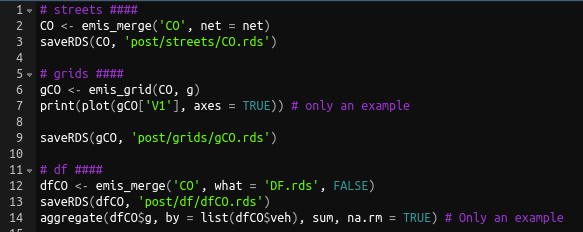

# Post estimation with `emis_post` {#post}


Once the emissions are estimated we obtained `EmissionsArray` objects, which as
mentioned before, they are arrays with the dimensions streets x age distribution of 
vehicles x hours x days.


```{r , eval = FALSE, include=FALSE, fig.cap='Post-emissions', out.width='100%', fig.asp=.75, fig.align='center'}
library(DiagrammeR)

p1 <- grViz("digraph boxes_and_circles {
      graph [overlap = false,
            fontsize = 10,
            rankdir = TB,
            fontname = Helvetica]


      node [shape = box,
            style = filled,
            fillcolor = pink,
            fixedsize = false,
            color = black,
            fontcolor = black,
            fontize = 12]

      EmissionsArray;
      GriddedEmissionsArray;


      node [shape = box,
            style = filled,
            fixedsize = false,
            fillcolor = grey88,
            color = black,
            fontcolor = black,
            fontize = 12]

      emis;
      emis_post;
      speciate;
      make_grid;
      emis_grid;
      emis_merge;

      edge [color = black,
            arrowhead = vee,
            penwidth = 1.5]

      emis -> EmissionsArray
      EmissionsArray -> emis_post
      emis_post->{speciate emis_merge emis_grid}
      speciate -> emis_merge
      {make_grid speciate emis_merge}->emis_grid
      emis_grid -> {EmissionsGrid GriddedEmissionsArray}
      }
      ")
```

```{r demispost, echo = FALSE, fig.cap='Post-emissions', out.width='100%', fig.asp=.75, fig.align='center'}
knitr::include_graphics("figuras/dia7.png")
```

Now the function `emis_post` reads the `EmissionsArray`
and and convert it to data-frames that are easier to manage. 

The arguments of `emis_post` are:

```{r 7.3}
args(vein::emis_post)
```

Where,

- `arra`: `EmissionsArray` obtained with the `emis` functions. It is an array of
emissions 4d: streets x category of vehicles x hours x days or 3d: streets x 
category of vehicles x hours
- `veh`: Character indicating the type of vehicle , for instance: "PC".
- `size`: Character indicating the size or weight, for instance: "<1400", 
"1400<cc<2000",
"GLP", "Diesel".
- `fuel`: Character indicating fuel, for instance: "Gasoline", "E_25",
"GLP", "Diesel".
- `pollutant`:  Character indicating the pollutant, for instance "CO", "NOx", etc.
- `by`: Character indicating type of output, "veh" for total vehicular category , 
"streets_narrow" or "streets_wide". This is the most important argument of this 
function. "streets_wide" returns a dataframe with rows as number of streets and 
columns the hours as days*hours considered, e.g. 168 columns as the hours of a whole 
week and "streets_wide repeats the row number of streets by hour and day of the week

Lets create some objects

## Emissions by street

From previous chapters we worked with `Vehicles`, `EmissionFactors` and estimate
emissions generating `EmissionsArray`. Now let's create an  `EmissionsArray`
object.

```{r 7.4}
library(vein)
library(veinreport)
library(cptcity)
library(ggplot2)
data(net)
data(profiles)
data(fe2015)
PC_G <- age_ldv(x = net$ldv, name = "PC")
# Estimation for 168 hour and local factors
pcw <- temp_fact(net$ldv, profiles$PC_JUNE_2014)
# June is not holliday in southern hemisphere
hdvw <- temp_fact(net$hdv, profiles$HGV_JUNE_2014)
speed <- netspeed(pcw + hdvw, net$ps, net$ffs, net$capacity, net$lkm, alpha = 1)
lef <- EmissionFactorsList(fe2015[fe2015$Pollutant=="CO", "PC_G"])
E_CO <- emis(veh = PC_G,lkm = net$lkm, ef = lef, speed = speed,
             profile = profiles$PC_JUNE_2014)
```

Now that we have our `EmissionsArray` E_CO, we can process it with the function
`emis_post`. The emissions by street are obtained with the argument `by` =
"streets_wide":

```{r 7.5}
E_CO_STREETS <- emis_post(E_CO, by = "streets_wide")
E_CO_STREETS[1:6, 1:3]
```

In the version 0.3.17 it was added the capability of returning an spatial object
class 'sf' with 'LINESTRING':

```{r pcco, fig.cap = "CO emisions of PC (g/h)"}
E_CO_STREETS <- emis_post(E_CO, by = "streets_wide", net = net)
class(E_CO_STREETS)
ggplot(E_CO_STREETS) + geom_sf(aes(colour = as.numeric(V9))) +
  scale_color_gradientn(colours = rev(cpt())) + theme_bw()+
  ggtitle("CO emissions at 08:00 (g/h)")
```

Now, if we estimate the NOx emissions of Light Trucks we will a slight different
pattern of emissions:

```{r ltnox, fig.cap = "NOx emisions of LT (g/h)"}
LT <- age_hdv(x = net$hdv, name = "LT")
lef <- EmissionFactorsList(fe2015[fe2015$Pollutant=="NOx", "LT"])
E_NOx <- emis(veh = LT, lkm = net$lkm, ef = lef, speed = speed,
              profile = profiles$PC_JUNE_2014)
E_NOx_STREETS <- emis_post(E_NOx, by = "streets_wide", net = net)
ggplot(E_NOx_STREETS) + geom_sf(aes(colour = as.numeric(V9))) +
  scale_color_gradientn(colours = rev(cpt())) + theme_bw()+
  ggtitle("NOX emissions at 08:00 (g/h)")
```


## Total emissions in data-frames

In order to obtain the total emissions in data-frame, the same function
`emis_post` is used, but in this case, with the argument `by` = "veh". We also
need to add arguments of `veh` for the type of vehicle, `size` the size or
gross weight, `fuel` and `pollutant`. The argument `net` is not required in
this case.

```{r 7.8}
E_NOx_DF <- emis_post(arra = E_NOx, veh = "LT", size = "Small", fuel = "B5",
                      by = "veh", pollutant = "NOx")
head(E_NOx_DF)
```

The resulting object is a data-frame with the name of the input array, then it has
the g/h. Also, the name of the vehicle, the size, fuel, pollutant, age and hour.
This is interesting because we can now what are the most pollutatn vehicle and
at which hour this emissions ocurres.

```{r 7.9}
E_NOx_DF[E_NOx_DF$g == max(E_NOx_DF$g), ]
```

The highest emissions by hour are of Light Trucks of 17 years of use at hour 11
on local time. However, it is possible to get more interesting insights of the
data. The datra can be aggregated by age, hour or plot all together as shown on
Fig. \@ref(fig:noxlt3). The highest emissions ocurre between 17 and 27 years of use.
This figure also shows the effect of emissions standards introduced in 
different years.

```{r noxlt1, fig.cap = "NOx emissions of LT by hour"}
df <- aggregate(E_NOx_DF$g, by = list(E_NOx_DF$hour), sum)
plot(df, type = "b", pch = 16, xlab = "hour", ylab = "NOx (g/h)")
```

```{r noxlt2, fig.cap = "NOx emissions of LT by age"}
library(ggplot2)
library(veinreport) # theme_black
df <- aggregate(E_NOx_DF$g, by = list(E_NOx_DF$age), sum)
names(df) <- c("Age", "g")
ggplot(df, aes(x = Age, y = as.numeric(g), fill = as.numeric(g))) +
  geom_bar(stat = "identity") +
  scale_fill_gradientn(colours = cpt()) + theme_black() +
  labs(x = "Age of use", y = "NOx (g/h)")
```


```{r noxlt3, fig.cap = "NOx emissions of LT"}
library(ggplot2)
library(veinreport) # theme_black
ggplot(E_NOx_DF, aes(x = age, y = as.numeric(g), fill = hour)) +
  geom_bar(stat = "identity") +
  scale_fill_gradientn(colours = cpt()) + theme_black() +
  labs(x = "Age of use", y = "NOx (g/h)")
```


## Merging emissions

The function `inventory` was designed to store the emissions of each type of vehicle in 
each directory. Hence, it was necessary to create a function that read and merge the 
emissions that are in each directory, returning a data-frame os a spatial feature 
data-frame. The function is `emis_merge`. As it can be seen on
Fig. \@ref(fig:demispost), `emis_merge` comes after `emis_post` or `speciate`. The arguments
of `emis_merge` are:

```{r 7.13}
args(vein::emis_merge)
```

Where,

- `pol`: Character. Pollutant.
- `what`: Character. Word to search the emissions names, "STREETS", "DF" or whatever name. It is important to include the extension .'rds'
- `streets`: Logical. If true, emis_merge will read the street emissions created with 
emis_post by "streets_wide", returning an object with class 'sf'. If false, it will read the
emissions data-frame and rbind them.
- `net`: 'Spatial feature' or 'SpatialLinesDataFrame' with the streets. It is expected #' 
that the number of rows is equal to the number of rows of street emissions. If #' not, the 
function will stop.
- `path`: Character. Path where emissions are located
- `crs`: coordinate reference system in numeric format from http://spatialreference.org/ to 
transform/project spatial data using sf::st_transform

In order to see how this functions works, let's run the example in the `inventory` function.
First, lets create a project, or in other words a directory named "YourCity", into the 
temporary directory. In this part you can place your project wherever you want with the
actual name of your city. Then run `inventory` with the default configuration.

```{r 7.14}
name = file.path(tempdir(), "YourCity")
vein::inventory(name = name, show.main = FALSE)
```

In my case, the files are in directory `r name`. Now, if you open the file file 
main.R, you will see:

```{r fmain, echo = FALSE, out.width='70%', fig.asp=.75, fig.align='center'}

```

This script starts with  `setwd` function, Then the first section is the network, where
user reads and prepares the traffic information. Then the second section runs a script
whichruns the age functions for the deault vehicular composition of the `inventory` function. The third section  estimates the emissions by running each input.R file inside the
directory _est_ The fourth section, creates a grid and run the script post.R is shown below:


```{r fpost, echo = FALSE, out.width='70%', fig.asp=.75, fig.align='center'}

```

The function `emis_merge` shown in line 2 is designed to read the all the files with names 
CO and the default argument `what` is "STREETS.rds", for instance, 
PC_GASOLINE_CO_STREETS.rds. Hence, this function reads all
the files under that condition. The other argument is `streets` with defailt value of 
`TRUE`, meaning that the function now knows that the resulting object must be an spatial
network, and the `net` argument is already calling the net object part of the VEIN data, 
the function will merge all the objects summing the emissions of all vehicle street by 
street. The resulting object is a spatial "LINESTRING" class of `sf`. This function assumes 
that emissons files are data.frames and non tests have been made to see if this function would read work `sf` objects.

On the other hand, the line 12 also runs all the emissions files whose names includes the word CO, but also including the words "DF.rds", which are the files from `emis_post` with
argument `by` equals to "veh". In this case, it reads and merge the data-frames and prints
the sum emissions by pollutant.

If the user source he file main.R, it will calculate the emissions and produce some plots.

```{r 7.17, eval = FALSE}
source(paste0(name, "/main.R"))
```


## Creating grids

Once we have processed our emissions array with `emis_post` and/or we have
spatial emissions, we can then create grids and allocate our emissions
into the grids. Lets check the function `make_grid` first:

```{r 7.18}
args(vein::make_grid)
```

This function originally used an `sp` approach. However, now uses an `sf`
approach for creating the grid. Actually, the arguments are pretty much the
same with the `sf::st_make_grid` with the exeption that is focused in returning
polygons with coordinates at centroids of each cell. Therefore, the arguments
height and polygon are deprecated. Lets create grid for our net. 

```{r grid1, fig.cap="Grid with spacing of 500 mts"}
library(vein)
library(sf)
data(net)
net <- st_transform(st_as_sf(net), 31983)
g <- make_grid(spobj = net, width = 500)
class(g)
plot(g$geometry, axes = TRUE)
plot(net$geometry, add = TRUE)
```

The class of `net` is `SpatialLinesDataFrame`, which is converted to `sf`. 
Then, as the coordinte reference system of net is WGS84 with epsg 4326, we
are transforming to UTM to create a grid with grid spacing of 500 mts. The class
of the grid object, `g` is "sf data.frame". 

## Gridding bottom-up emissions with `emis_grid`

The function`emis_grid` allocates emissions proportionally to each grid cell. 
The process is performed by intersection between geometries and the grid. It 
means that requires "sr" according with your location for the projection. It is 
assumed that spobj is a spatial*DataFrame or an "sf" with the pollutants in data.
This function return an object class "sf".

Before `sf` era, i tried to use`raster::intersect` which imports `rgeos` and
took **ages**. Then I started to use -@QGIS (https://www.qgis.org), and later 
the R package -@RQGIS which takes 10 minutes for allocating emissions of the
mega-city of São Paulo and a grid spacing of 1 km. *10 min is not bad*. However,
when `sf` appeared and also, included the Spatial Indexes (https://www.r-spatial.org/r/2017/06/22/spatial-index.html), it changed the game.
A new era started. It took **5.5 seconds**. I could not believe it. But there
also some i could accelerate this process importing some `data.table` aggregation
functions. Now `emis_grid` can aggegate big spatial extensions. I havent
tried yet at continental scale, but I will try. Anyways, let's go see the
arguments:

```{r 7.20}
args(vein::emis_grid)
```

Where,

- `spobj` : A spatial dataframe of class "sp" or "sf". When class is "sp" it is transformed to "sf".
- `g`: A grid with class "SpatialPolygonsDataFrame" or "sf".
- `sr`: Spatial reference e.g: 31983. It is required if spobj and g are not projected. Please, see http://spatialreference.org/.
- `type`: type of geometry: "lines" or "points".

```{r netgldv, fig.cap="Spatial grid of HDV traffic 500 mts"}
data(net)
net@data <- data.frame(hdv = net[["hdv"]])
g <- make_grid(spobj = net, width = 1/102.47/2)
netg <- emis_grid(net, g)
head(netg)
plot(netg["hdv"], axes = TRUE)
```

The example in this case, showed the allocation of traffic. The resulting object
is a `sf` with the sum of the attributes inside each grid cell. This means that,
when the input are street emissions at different hours, it will return gridded
emissions at each hour:

```{r Noxg, fig.cap="NOx emissions for 00:00 [g/h]"}
E_NOx_STREETS <- emis_post(E_NOx, by = "streets_wide", net = net)
NOxg <- emis_grid(E_NOx_STREETS, g)
plot(NOxg["V1"], axes = TRUE)

```

## Gridding top-down emissions with `emis_dist`

When a top-down approach emissions inventory is made, the spatial distribution
of emissions must be made considering some proxy. In the case of vehicular 
emissions, it can be done with data of Open Street Maps,distributing
the emissions into the streets. This can be done with the function with
the function `emis_dist`. In generaly, this function distribute the emissions
into spatial feature on any type, not only lines.


```{r 7.23}
args(vein::emis_dist)
```

Where,

- `gy`: Numeric; a unique total (top-down) emissions (grams)
- `spobj`: A spatial dataframe of class "sp" or "sf". When class is "sp" it is transformed to "sf".
- `pro`: Matrix or data-frame profiles, for instance, pc_profile.
- `osm`: Numeric; vector of length 5, for instance, c(5, 3, 2, 1, 1). The first element covers 'motorway' and 'motorway_link. The second element covers 'trunk' and 'trunk_link'. The third element covers 'primary' and 'primary_link'. The fourth element covers 'secondary' and 'secondary_link'. The fifth element covers 'tertiary' and 'tertiary_link'.
- `verbose`: Logical; to show more info.

In order test this function, it will be used the function `osmdata`.
The process presented in the following code, consists in downloading
the openstreetmap data delimited by the coordenaes og the grid `g`.
Then filter only the lines 


```{r osmsp, fig.cap="Open street map lines"}
library(osmdata)
library(sf, quietly = T)
osm <- osmdata_sf(
  add_osm_feature(
    opq(bbox = st_bbox(g)),                             
    key = 'highway'))$osm_lines[, c("highway")]
st <- c("motorway", "motorway_link", "
        trunk", "trunk_link", 
        "primary", "primary_link", 
        "secondary", "secondary_link", 
        "tertiary", "tertiary_link")
osm <- osm[osm$highway %in% st, ]
plot(osm, axes = T)
```

The we will distribute the total emissions of E_NOx `r sum(E_NOx)` into
this new lines. There is the argument osm, which gives percentage weights to the
type of streets in the following order: "motorway", "trunk", "primary",
"secondary" and "tertiary" . For instance **osm = 5:1** means 33% of emissions
into "motorway" because it is 5 / (1 + 2 + 3 + 4 + 5).

```{r osmemi, fig.cap="Emissions distributed into OSM lines"}
estreet <- emis_dist(gy = sum(E_NOx), spobj = osm)
estreet$emission_osm <- emis_dist(gy = sum(E_NOx), spobj = osm, 
                                   osm = 5:1)$emission
plot(estreet[c("emission")], 
     main = paste0("Emissions with Default distribution: ",
                   round(sum(estreet$emission)), " [g]"), 
     axes = T,pal = cpt(colorRampPalette = T))
plot(estreet[c("emission_osm")],
          main = paste0("Emission with OSM distribution: ",
                        round(sum(estreet$emission_osm)), " [g]"),  
     axes = T,pal = cpt(colorRampPalette = T))
```


## Gridding top-down emissions with `grid_emis`

Another option to distribute top-down emissions consits in the use of
the function `grid_emis`, which does a similar job than `emis_dist`
but cell by cell. This means that the total emissions are distributed 
inside each grid cell and not one distribution for the whole domain.
This functions runs a lapply of `emis_dist`, hence it takes a litle 
bit of more time.


```{r 7.26}
args(vein::grid_emis)
```

Where,

- `spobj`: A spatial dataframe of class "sp" or "sf". When class is "sp" it is transformed to "sf".
- `g`: A grid with class "SpatialPolygonsDataFrame" or "sf". This grid includes the total emissions with the column "emission". If profile is going to be used, the column 'emission' must include the sum of the emissions for each profile. For instance, if profile covers the hourly emissions, the column 'emission' bust be the sum of the hourly emissions. 
- `sr`: Spatial reference e.g: 31983. It is required if spobj and g are not projected. Please, see http://spatialreference.org/.
- `pro`: Numeric, Matrix or data-frame profiles, for instance, pc_profile.
- `osm`: Numeric; vector of length 5, for instance, c(5, 3, 2, 1, 1). The first element covers 'motorway' and 'motorway_link. The second element covers 'trunk' and 'trunk_link'. The third element covers 'primary' and 'primary_link'. The fourth element covers 'secondary' and 'secondary_link'. The fifth element covers 'tertiary' and 'tertiary_link'.
- `verbose`: Logical; to show more info.

It is required that the grid

```{r osmspgrid, fig.cap="Use of grid_emis"}
NOxg <- NOxg[, "V1"]
names(NOxg)[1] <- "emission"
xnet <- grid_emis(osm, NOxg)
plot(xnet, axes = T,pal = cpt(colorRampPalette = T))
```
