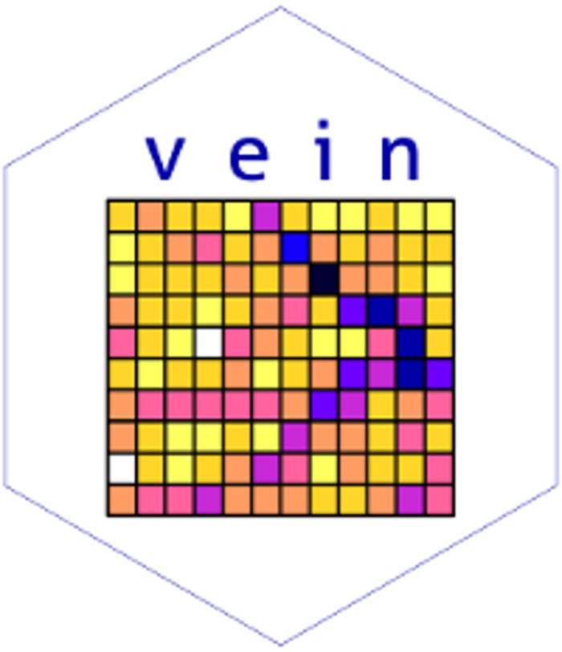

--- 
title: "Vehicular emissions inventory with VEIN"
author: "Sergio Ibarra-Espinosa"
date: "`r Sys.Date()`"
site: bookdown::bookdown_site
documentclass: krantz
lot: yes
lof: yes
fontsize: 12pt
monofont: "Source Code Pro"
monofontoptions: "Scale=0.7"
number_sections: true
output:
  bookdown::gitbook:
    hightlight: tango
bookdown::pdf_book:
keep_tex: yes
includes:
  in_header: preamble.tex
theme: united
always_allow_html: yes
classoption: graybox,envcountchap,sectrefs
bibliography: [book.bib, packages.bib]
biblio-style: apalike
link-citations: yes
github-repo: ibarraespinosa/veinbook
description: "This is a minimal example of using the bookdown package to write a book. The output format for this example is bookdown::gitbook."
---

<!--
install.packages(c("googleway", "DiagrammeR"))
devtools::install_github("atmoschem/veinreport")
install pandoc*
install texlive-full
-->

<!-- bookdown::render_book("index.Rmd", rmarkdown::pdf_document(toc = TRUE, number_sections = TRUE, fig_caption = TRUE, citation_package = "biblatex")) 
https://gist.githubusercontent.com/marcora/cb37b2432c072e8e9d77/raw/a2d676766559c52981774193d88b0e9ff22bbb3d/gistfile1.txt
-->

<!-- https://tex.stackexchange.com/questions/137428/tlmgr-cannot-setup-tlpdb -->
<!-- https://itsfoss.com/install-fonts-ubuntu-1404-1410/ -->
<!-- tlmgr install alegreya -->
<!-- https://fonts.google.com/specimen/Alegreya+SC?selection.family=Alegreya+SC -->

# Preface {-}


<!-- ```{r echo = F, eval = FALSE} -->
<!--  -->
<!-- ``` -->

<!--  -->
<!-- render_book("veinbook.Rmd", pdf_book()) -->

<!-- render_book("veinbook.Rmd", epub_book()) -->

This book is about the process for estimating vehicular emissions. This process
is complex and _can_ be dificult. It is required a big amount of information related to traffic, emissions factors and then process the outpus for the desired purpose. 
In this book this process is addressed with the **VEIN** [@gmd-2017-193] model, 
which is an R package available at https://CRAN.R-project.org/package=vein}.


## Purpose {-}

I wrote this book to provide instructions to all possible users who want to 
estimate vehicular emissions using VEIN. VEIN provides several function which
are related to each other reading different traffic sources and emission factors
for different pollutants. However, incorporating all the functions with
input/output (I/O) process can be difficult. Moreover, communicating the
recommended practices and instructions to a increasingly broader audience
can be more difficult. Therefore, the purpose of this book is to reach the 
maximum amount of interested people in a simple way. The language chosen is
engligh because it is the global language.

## Structure {-}

Chapter \@ref(intro) covers the introduction to this book including the 
installation of R packages and dependent libraries to several operative systems.
Chapter \@ref(basic) covers basics commands using R. Chapter \@ref(st) presents 
the function _inventory_ to produce an structure of directories and scripts 
for runnin vein. Chapter \@ref(traffic) covers the required traffic data for
inputting into VEIN including differenttypes and sources of information.
Chapter \@ref(ef) includes the emission factors that are included into the
package and also, examples for inputing and creating
new emission factors. Chapter \@ref(est) presents the estimations functions and
tips. Chapter \@ref(post) includes the functions to do post-estimations to 
generate emission data-bases and also emissions at each street. Chapter 
 \@ref(he) and \@ref(ep) provides applications into air quality
modeling, some studies with to investigte health effects and lastly, the use of
VEIN as a tool for environmental planning.

## About the author {-}

Sergio Ibarra Espinosa is a chilean Environmental and Loss Prevention Engineer
from the Technologycal Metropolitan University (UTEM) where study the health
effects of air pollution using R in year 2007. Then started working at the 
National Center for Environment (CENMA) in Chile focused on emissions from vehicles,
airports, biomass burning and minning industry. Then obtained a MSc. in 
Environmental Planning and Managment from the University of Chile, with a 
scholarship form CENMA. Then obtained a PhD. in Meteorology at the Institute of 
Astronomy, Geophysics and Atmospheric Sciences (IAG) from the University of São 
Paulo (USP) with scholarship from CAPEs during the first year and Becas Chile
for the last three years. During his PhD. he learned programming with R and 
developed the R package VEIN.

```{r include=FALSE}
# automatically create a bib database for R packages
knitr::write_bib(c(
  .packages(), 'bookdown', 'knitr', 'rmarkdown'
), 'packages.bib')
```

\mainmatter
